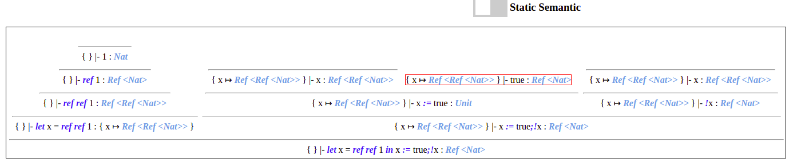

# Getting started

## Installation

Make sure to have node, npm, and typescript installed.

> run "npm i" in folder "code"

> run "npm run watch" in folder "code"

> install the extension "Live Server" on your vscode and launch a server with the file "index.html"

## Documentation

Coming soon :) (but your can start read the code. Entry point: "app.ts")

## Preview

Static and dynamic semantics implemented up to page 251

